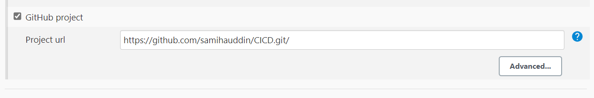
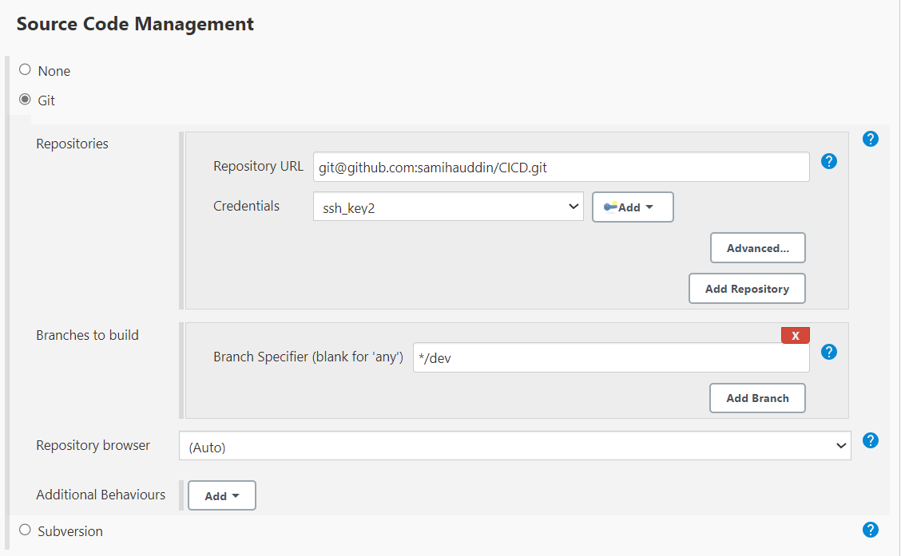

### What are webhooks?

webhooks are a way for one system to notify another system that a specific event has occurred. These events could be anything from code commits and pull requests to issues being opened or closed. 

Webhooks facilitate real-time communication and automation between different systems and services involved in the software development lifecycle.

### How to create a Webhook 

**Step 1:** Navigate to your Github account.

**Step 2:** Choose the repository which you want to configure the webhooks for and go to the `Settings`.

**Step 3:** Go to the `Webhooks` tab and press the `Add webhook` button.

**Step 4:** Configure the webhook settings

- **Payload URL** — `http://18.130.36.1:8080/github-webhooks/` 
- **Content type** — select `application/json`

Leave everything else as default 

**Step 5:** Save the webhook settings.

### Setting up GitHub webhook with Jenkins 

**Step 1:** Select `New Item`  
**Step 2:** Add a name, select `Freestyle project`, then `ok`  

Step 3: Add a description  
**Step 4:** Check `Discard old builds`, enter `3`

**Step 5:** Navigate to your GitHub project that has the app 
- Click green code
- copy the HTTPS url
- return to jenkins and enter the url

**Step 6:** Office 365 Connector 
- Check `Restrict where this project can run`
- Enter `sparta-ubuntu-node`

**Step 7:** Source Code Management 
- Check `Git`
- Copy and paste your SSH URL for your repo containing the app
- Credentials: select the username you have given when you added the SSH key of your private key 
- Branch specifier `*/main`

**Step 8:** Build Triggers
- Check `Github hook trigger for GITScm polling`

**Step 9:** Build Environment 
- Check `Provide Node`

**Step 10:** Build
- Select `Add build step`
- Select `Execute shell`
- Add in the below commands
- Then select `save`

### Testing Jenkins with Webhook 

1. You can now make a small change in your local repository  
2. Commit and push to Github  
3. This will communicate with Jenkins, starting the CI process 
4. If it is successful a new build will automatically be displayed on Jenkins.
5. If it has failed, you will also be notified on Jenkins

