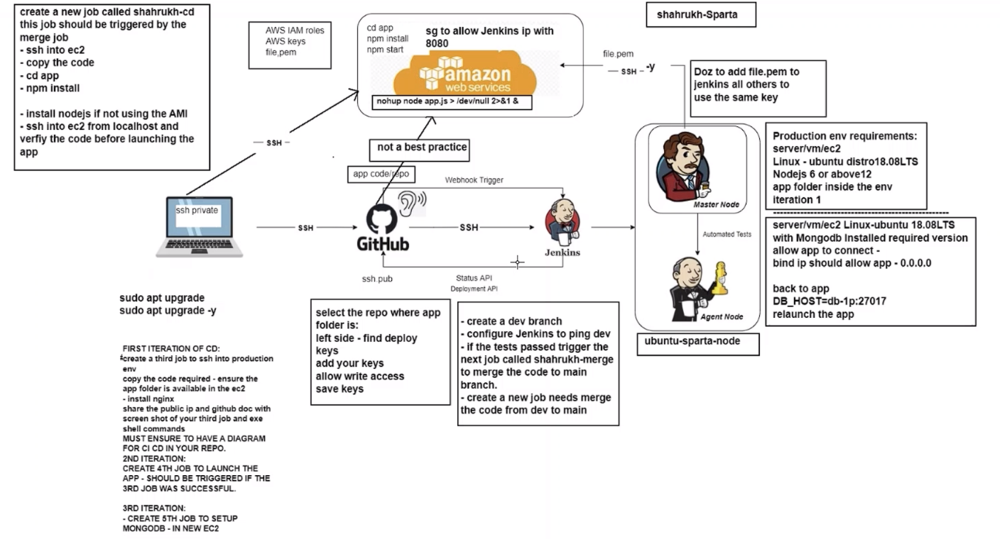
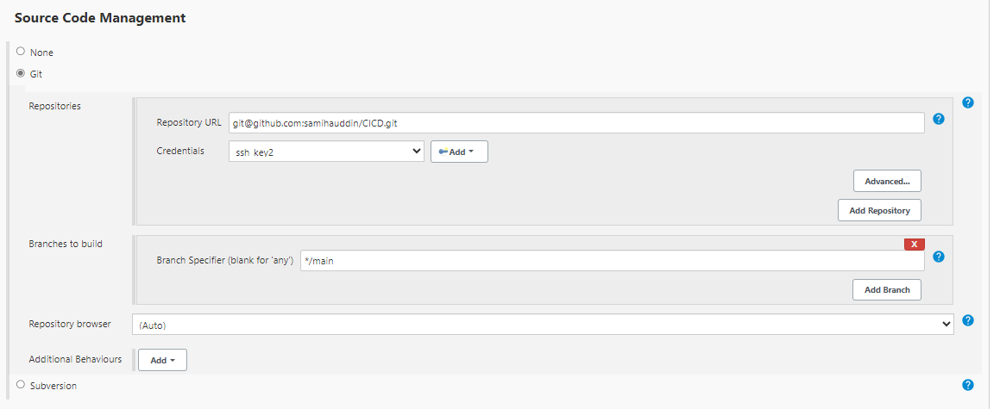
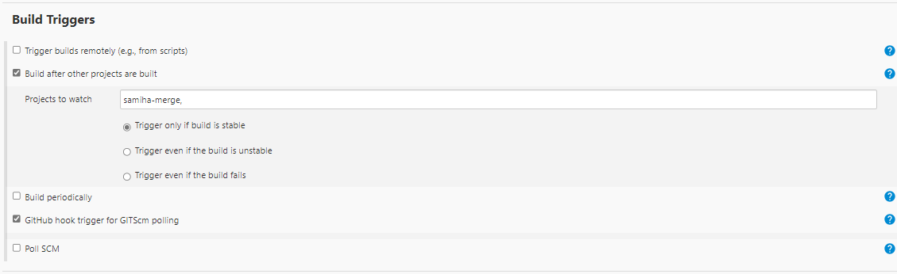
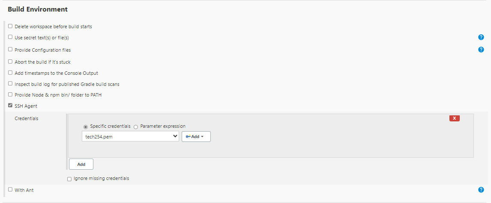

### Continuous Deployment 



### Prerequisites

1. Set up first CI job
2. Set up second job to allow for merge 

Follow steps using notes: https://github.com/samihauddin/CICD/blob/main/jenkins_notes.md

### Creating an EC2 Instance

**Step 1:** Launch an instance with the appropriate security group to allow jenkins 

Follow steps to launch instance: https://github.com/samihauddin/AWS_cloud_computing/blob/main/launching_instances.md


### Creating a 3rd Job (First Iteration)

**Step 1:** Create a new job 
- Select: `New Item` and Enter Name 
- Add `Description`
- `Check Discard old buils: 3`
- Check `GitHub project`
- Enter your repo HTTPS URL
- Check `Restrict where this project can be run`
- Enter: `sparta-ubuntu-node`

**Step 2:** Source Code Management

- Check `Git`
- Add your repo SSH URL, select your private key
- Branches to build `*/main`



**Step 3:** Build Triggers



**Step 4:** Build Environment 



**Step 5:** Build
- Select `Execute shell`
- Enter the commands to run nginx, then save

```
rsync -avz -e "ssh -o StrictHostKeyChecking=no" app ubuntu@54.194.117.61:/home/ubuntu
ssh -o "StrictHostKeyChecking=no" ubuntu@54.194.117.61 <<EOF

    sudo apt-get update -y
    sudo apt-get upgrade -y
    sudo apt-get install nginx -y
    sudo systemctl restart nginx
    sudo systemctl enable nginx
EOF

```
**Step 6:** Manually `Build Now` to test if build is successful.
- If it works, add it to post build actions of the second job.

### Creating a 4th Job (Second Iteration)

**Step 1:** Create a new job 
- Select: `New Item` and Enter Name 
- Add `Description`
- `Check Discard old buils: 3`
- Check `GitHub project`
- Enter your repo HTTPS URL
- Check `Restrict where this project can be run`
- Enter: `sparta-ubuntu-node`

**Step 2:** Source Code Management

- Check `Git`
- Add your repo SSH URL, select your private key
- Branches to build `*/main`


**Step 3:** Build Triggers
- Check `Build after other projects are built`
- Projects to watch: `name of 3rd job`, `Trigger only if build is stable`
- Check `GitHub hook trigger for GITScm polling`

**Step 4:** Build Environment 
- Check `SSH-agent`
- Find your SSH KEY 


**Step 5:** Build
- Select `Execute shell`
- Enter the commands to start app, then save

```
ssh -A -o "StrictHostKeyChecking=no" ubuntu@54.194.117.61 <<EOF

# install Node.js and npm
curl -sL https://deb.nodesource.com/setup_12.x | sudo -E bash -
sudo apt install nodejs -y

# install pm2 globally
sudo npm install pm2 -g

cd app

# install project dependencies
npm install

# start the node.js application
pm2 start  app.js
pm2 restart app.js

```
**Step 6:** Manually `Build Now` to test if build is successful

**Step 7:** Navigate to your public IP address URL, then add `:3000`, your app should now be running. 

### Creating a 5th Job (Third Iteration)