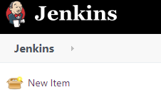
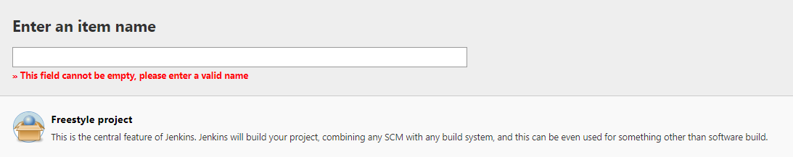
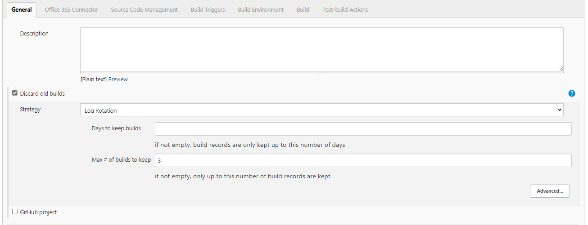
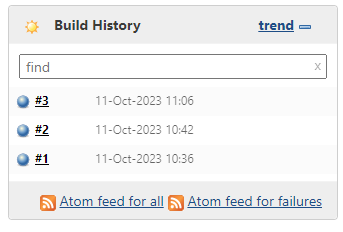
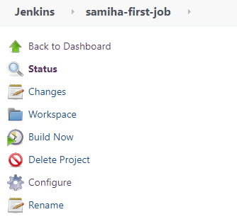

## Navigating Jenkins

### Creating a job in Jenkins

**Step 1.** Log In to Jenkins: Open your web browser and navigate to your Jenkins server's URL.  
**Step 2.** Log in using your credentials.  
**Step 3.** Create a New Job: From the Jenkins dashboard, click on "New Item" or "Create New Job" on the left-hand side.  

**Step 4.** Enter a name for your job and select the type of job you want to create.  
**Step 5.** Select Freestyle project  

**Step 6.** Check `Discard old builds`  
**Step 7.** `Max # of builds to keep: 3`  

**Step 8.** Press ok  

### Testing Jenkins - does Jenkins have the env required for our deployment?

Step 1. Follow the above steps  
Step 2. Navigate to `Build`  
Step 3. Select `Execute Shell`  
Step 4. Enter the commands ` whoami uname -a`  
Step 5. Enter `Save`  

### Triggering the job manually

**Step 1.** Locate the job by using the dropdown and select `Build now`  

**Step 2**. Navigate to the # use the drop down and select `console output`  
**Step 3.** You will now be able to see the env required for deployment 

### Triggering the job automatically

**Step 1.** Select your job  
**Step 2.** Navigate to `Configure`

Step 3. Navigate to `Post-build Actions`  
Step 4. Enter the name of your second job  
Step 5. Check `Trigger only if build is stable`  
Step 6. Then `Save`  