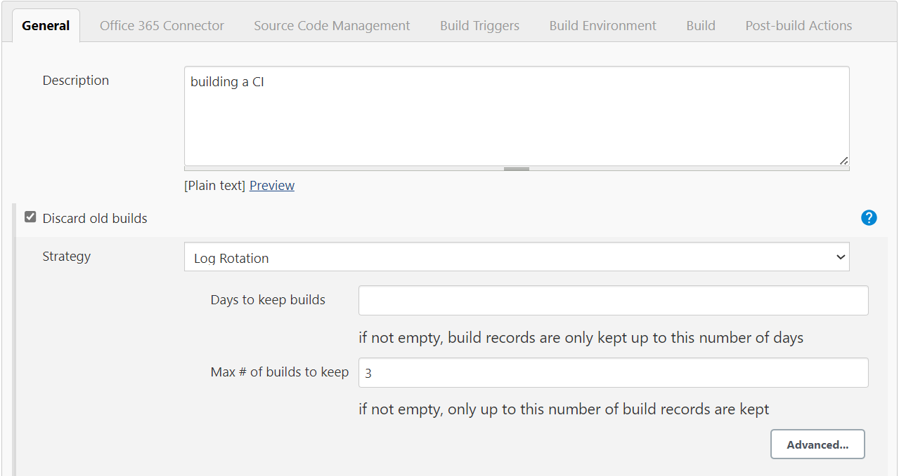
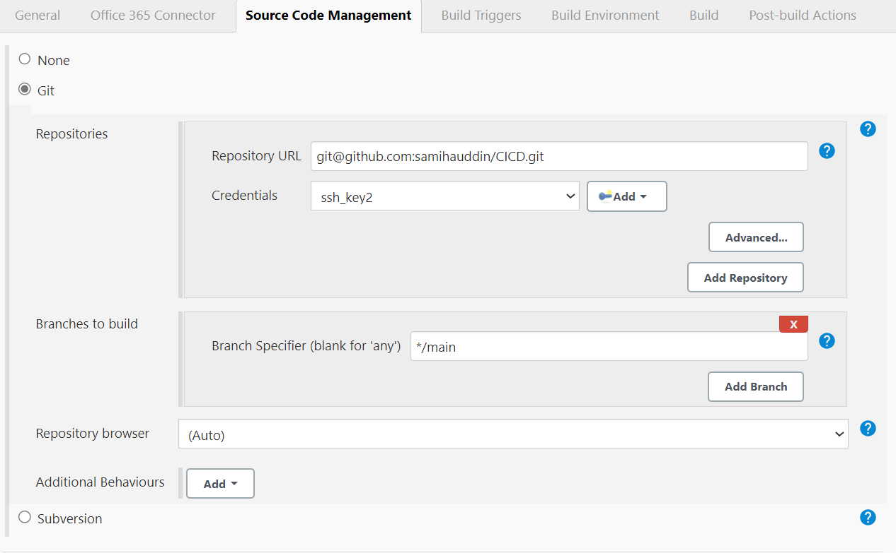
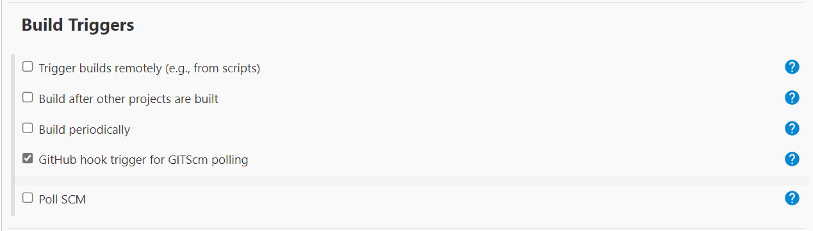
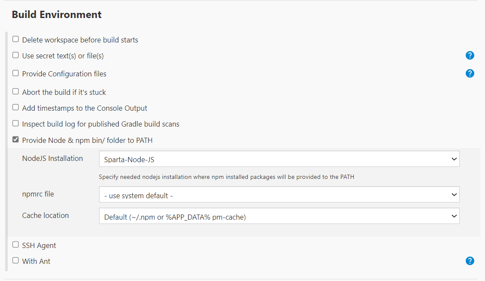
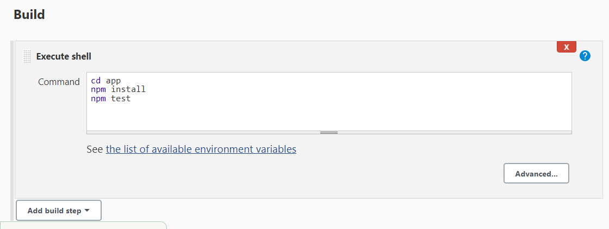
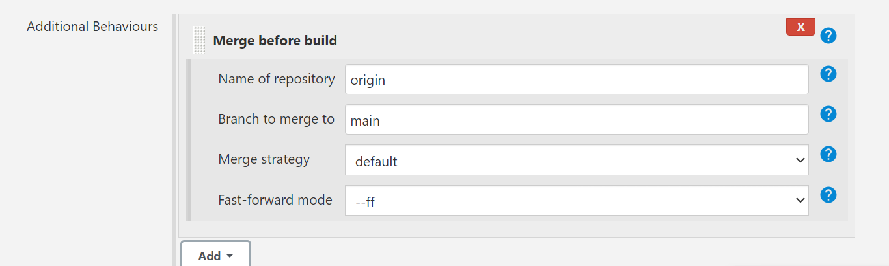
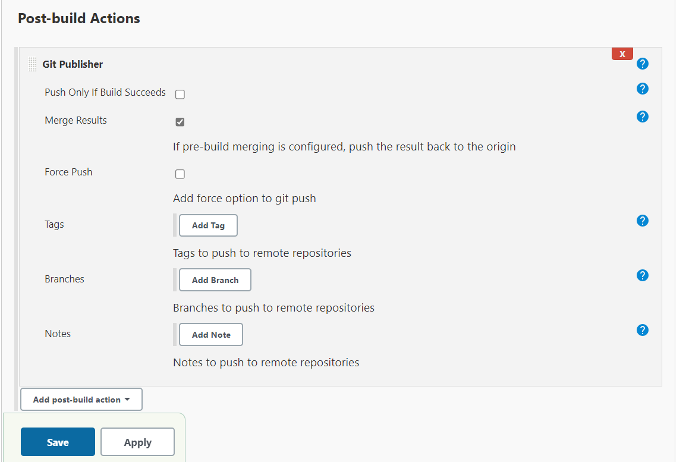

## Jenkins and CI/CD

### Creating a Job for CI 

**Step 1:** log into Jenkins and click 'New Item'
- Enter a name 
- click 'Freestyle project', then okay 

**Step 2:** General 
- Enter a description
- `Discard old builds: 3`



**Step 3:** Check `GitHub project`
- Enter your repo HTTPS URL


**Step 4:** Office 365 Connector 

- Check `Restrict where this project can be run`
- Label Expression: `sparta-ubuntu-node`


**Step 5:** Source Code Management
- Check `Git`
- Enter your SSH URL for your repository
- Credentials: select your private key 

**Step 6:** Source Code Management
- Branch Specifier: `*/dev`



**Step 7:** Build Triggers
- Check: `GitHub hook trigger for GITScm polling`



**Step 8:** Build Environment 
- Check `Provide Node & npm bin/folder to PATH`



**Step 9:** Build
- Enter the following commands 

```
cd app
npm install
npm test
```



**Step 10:** Post-build Actions


### Creating a job for a merge 

**Step 1:** Create a new job `New Item`
- Add `Description`
- `Check Discard old buils: 3`
- Check `GitHub project`
- Enter your repo HTTPS URL
- Check `Restrict where this project can be run`
- Enter: `sparta-ubuntu-node`
- Check `Git`
- Add your repo SSH URL, select your private key
- Branches to build `*/dev`

**Step 2:** Select `Add Additional Behaviours`
- Then select: `Merge before build`
- Enter Name of repository: `origin`
- Branch to merge to `main`



**Step 3:** Build Triggers
- Leave all unchecked

**Step 4:** Build Environment
- Check `SSH Agent`


**Step 5:** Post-build Actions
- Select `Git Publisher`
- Check `Merge Results`
- Then press Save



**Step 6:** Navigate to GitBash terminal 
- Change main to Dev

```
git branch dev
```

**Step 7:** Make a change in your local repository
- Commit changes
- Push to GitHub
- Whilst pushing Jenkins will be triggered and allow dev to merge to main

### Creating Jenkins CI/CD

**Step 1:** Creating a new job `New Item`
- Log into Jenkins 
- Select `New Item`
- Create a name `Samiha-cd`
- Configure Office 365 Connector, Source Code Management, Build Triggers, Build Environment

**Step 2:** Triggering the New Job from Your Merge Job
- Navigate to the your 2nd job created
- Select a `post-build action`
- Select: `Build other projects`
- Projects to build: `Samiha-cd`

**Step 3:** Allowing Jenkins to SSH into EC2 Instance

- Set up SSH access for Jenkins to your EC2 instance. 

**Step 4:** Add the -y Command for SSH Access

- Add the -y commands so you don’t need to manually allow the SSH into your instance.

**Step 5:** Copying the App Code

**Step 6:** cd into the app folder

**Step 7:** Run npm install

**Step 8:** Install Node.js

**Step 9:** Verify the Code via SSH

**Step 10:** Modify the Application Name


