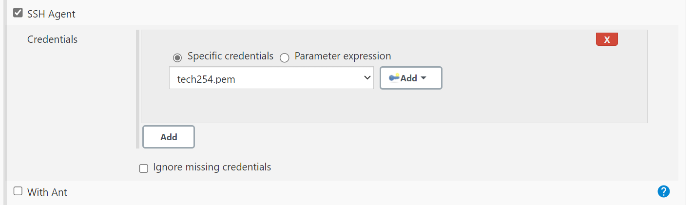

### The Github plugin

GitHub plugins, are third-party tools and services that can be connected to GitHub repositories to enhance functionality, automate workflows, and improve collaboration among developers.

### The Git publisher plugin

The Git Publisher plugin is a Jenkins plugin that allows you to push code changes or files from your Jenkins build jobs to a Git repository. 


### Creating a new job to merge code from dev to main

Step 1: Create a new job `New Item`
- Add `Description`
- `Check Discard old buils: 3`
- Check `GitHub project`
- Enter your repo HTTPS URL
- Check `Restrict where this project can be run`
- Enter: `sparta-ubuntu-node`
- Check `Git`
- Add your repo SSH URL, select your private key
- Branches to build `*/dev`

Step 2: Select `Add Additional Behaviours`
- Then select: `Merge before build`
- Enter Name of repository: `origin`
- Branch to merge to `main`


Step 3: Build Triggers
- Leave all unchecked

Step 4: Build Environment
- Check `SSH Agent`



Step 5: Post-build Actions
- Select `Git Publisher`
- Check `Merge Results`
- Then press Save


Step 6: Navigate to the first job you have created 

- Change Branch Specifier: `*/dev`


Step 7: Post-build Actions

- Select `Build other projects`
- Enter the project name of your second job
- Then `save`


Step 8: Navigate to GitBash terminal 
- Change main to Dev

```
git branch dev
```

Step 9: Make a change in your local repository
- Commit changes
- Push to GitHub
- Whilst pushing Jenkins will be triggered and allow dev to merge to main